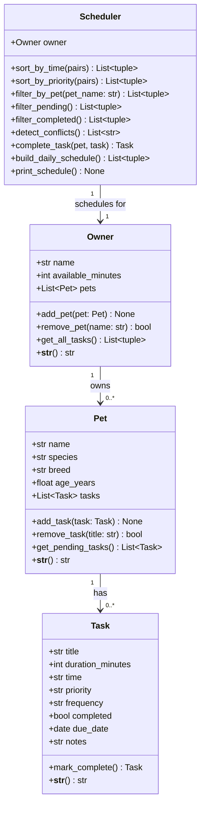

```mermaid
classDiagram
    class Task {
        +str title
        +int duration_minutes
        +str time
        +str priority
        +str frequency
        +bool completed
        +date due_date
        +str notes
        +mark_complete() Task
        +__str__() str
    }

    class Pet {
        +str name
        +str species
        +str breed
        +float age_years
        +List~Task~ tasks
        +add_task(task: Task) None
        +remove_task(title: str) bool
        +get_pending_tasks() List~Task~
        +__str__() str
    }

    class Owner {
        +str name
        +int available_minutes
        +List~Pet~ pets
        +add_pet(pet: Pet) None
        +remove_pet(name: str) bool
        +get_all_tasks() List~tuple~
        +__str__() str
    }

    class Scheduler {
        +Owner owner
        +sort_by_time(pairs) List~tuple~
        +sort_by_priority(pairs) List~tuple~
        +filter_by_pet(pet_name: str) List~tuple~
        +filter_pending() List~tuple~
        +filter_completed() List~tuple~
        +detect_conflicts() List~str~
        +complete_task(pet, task) Task
        +build_daily_schedule() List~tuple~
        +print_schedule() None
    }

    Owner "1" --> "0..*" Pet : owns
    Pet "1" --> "0..*" Task : has
    Scheduler "1" --> "1" Owner : schedules for
```